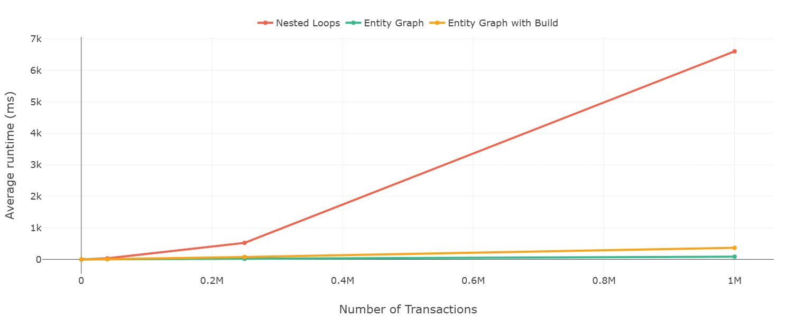

# Entity Walker


Entity Walker is a small, zero-dependency TypeScript library for working with normalised relational data as an immutable, type-safe graph.

It lets you define entities and their relationships via foreign keys, then traverse the graph with fully typed, autocompleted accessors. Every entity and relation is typed, so your IDE will guide you with autocomplete and prevent mistakes. It makes

## What You Can Use It For

* Normalized API data: fetch entities from an API, normalize them, and query them efficiently.

* Read-heavy applications: dashboards, reporting tools, analytics, finance trackers.

* Complex relationships: easily navigate nested relations without writing nested loops.

* Reverse lookups: find all entities pointing to a given entity.

* Safe queries: optional relations, missing entities, and broken foreign keys are handled gracefully.

If your data has multiple types of entities referencing each other and you need fast, readable, safe access, Entity Walker is designed for that.

## Features

* Immutable & safe: returned entities are frozen.

* Type-safe & autocompleted: TypeScript knows every entity type and relation.

* Bidirectional and optional relations: traverse forwards or backwards safely.

* Filter/map/flatMap references: work directly on related entities like arrays.

* Safe defaults: missing relations return empty arrays or undefined.

* Performance-friendly: rebuilding the graph frequently is still faster than nested loops for large datasets.

## Installation

```bash
npm install entity-walker
```

## Usage

### 1. Define Your Entity Types
You can define any type with `id` and any foreign keys (the foraign key names can't end with "References" suffix).
```typescript
// Example entity types
type Transaction = { id: string; subcategoryId: string };
type Subcategory = { id: string; name: string; mainCategoryId: string };
type MainCategory = { id: string; name: string; expenseTypeId?: string; incomeTypeId?: string };
type ExpenseType = { id: string; description: string };
type IncomeType = { id: string; description: string };
```

### 1. Define Your Schema & Edges

First define custom schema type. Here it called `Schema`. The edges object should have the `as const satisfies GraphEdges<Schema>` type assertion to ensure type safety.

```typescript
type Schema = {
  transaction: Transaction;
  subcategory: Subcategory;
  mainCategory: MainCategory;
  expenseType: ExpenseType;
  incomeType: IncomeType;
};

// Child to parent relationships with foreign keys
//
//    Transaction
//        |
//        |  (subcategoryId)
//        v
//    Subcategory
//        |
//        |  (mainCategoryId)
//        v
//    MainCategory
//        |\
//        | \
//        |  \ (expenseTypeId)
//        |   \
//        |    \
//        |     v
//        |     ExpenseType
//        |
//        |
//        | (incomeTypeId)
//        v
//    IncomeType

export const edges = {
  transaction: {
    subcategory: { bidirectional: true, resolve: t => t.subcategoryId },
  },
  subcategory: {
    mainCategory: { bidirectional: true, optional: true, resolve: s => s.mainCategoryId },
  },
  mainCategory: {
    expenseType: { bidirectional: true, optional: true, resolve: m => m.expenseTypeId },
    incomeType: { resolve: m => m.incomeTypeId },
  },
} as const satisfies GraphEdges<Schema>;

// Define the graph type for more convenient usage
type CustomGraph = GraphDef<Schema, typeof edges>;

```

### 3. Build the Graph with Data

```typescript
// List of entities wrapped in Entities<Schema>
const entities: Entities<Schema> = {
    transaction: [
        { id: "tx1", subcategoryId: "sub1" },
        { id: "tx2", subcategoryId: "sub2" },
        { id: "tx3", subcategoryId: "sub1" },
    ],
    subcategory: [
        { id: "sub1", name: "sub1", mainCategoryId: "cat1" },
        { id: "sub2", name: "sub2", mainCategoryId: "cat1" },
    ],
    mainCategory: [
        { id: "cat1", name: "Food", expenseTypeId: "et1", incomeTypeId: "it1" },
        { id: "cat2", name: "Food", expenseTypeId: "error", incomeTypeId: "error" },
        { id: "cat3", name: "Food" },
    ],
    expenseType: [{ id: "et1", description: "Groceries" }],
    incomeType: [{ id: "it1", description: "Salary" }],
};

const graph: EntityGraph<CustomGraph> = createEntityGraph<Schema>().create({
    entities,
    edges,
});
```


Note: The graph only reads immutable data; it does not modify your original dataset.

### 4. Access Entities
By going into the direction of the defined edges we assume 1-to-1 relations. If an ege is bidirectional, you can also go in the reverse direction which assumes 1-to-many relations. The reverse relations can be accessed via `[...]References` suffixed methods that return arrays of references.

```typescript
// Access a single entity
const tx = graph.transaction("tx1").get();

// Traverse relations
const expenseTypeDesc = graph
  .transaction("tx1")
  .subcategory()
  .mainCategory()
  .expenseType()
  .get();

// Reverse traversal
const transactionsByCategory = graph
  .mainCategory("cat1")
  .subcategoryReferences()
  .flatMap(sc => sc.transactionReferences())
  .map(tn => tn.get().id);

```

### 5.  Safe Handling of Missing Data

Optional edges only provide `tryGet()` methods that return `undefined` if the relation is missing, while required edges can use `tryGet()` and `get()`. Using `get()` on a required relation throws an error if the relation is not found.

```typescript
// ExpenseTpe | undefined
const missingExpense = graph.mainCategory("cat3").expenseType().tryGet();

// Throws an error
graph.mainCategory("cat3").incomeType().get();

```

### 6.  Filtering & Mapping References

```typescript
const treansactionIds = graph.subcategory("sub1")
  .transactionReferences()
  .filter(tn => tn.subcategory().mainCategory().tryGet()?.expenseTypeId === "et1")
  .map(tn => tn.get().id);
```

## Performance & Benchmarks

Entity Walker uses indexed lookups. Graph building creates efficient data structures for fast access. Frequent rebuilds can add minimal overhead, but using the graph for queries are still often faster than nested loops. Even rebuilding the graph for each query is often faster than nested loops:



This benchmark shows Entity Walker's performance against nested loops for various dataset sizes (pure for loops with indexes) against Entity Walker with graph rebuilds for each query. The test uses random id accesses on komplex relations. As the dataset size increases, Entity Walker's indexed lookups outperform nested loops significantly even with the overhead of rebuilding the graph each time.
