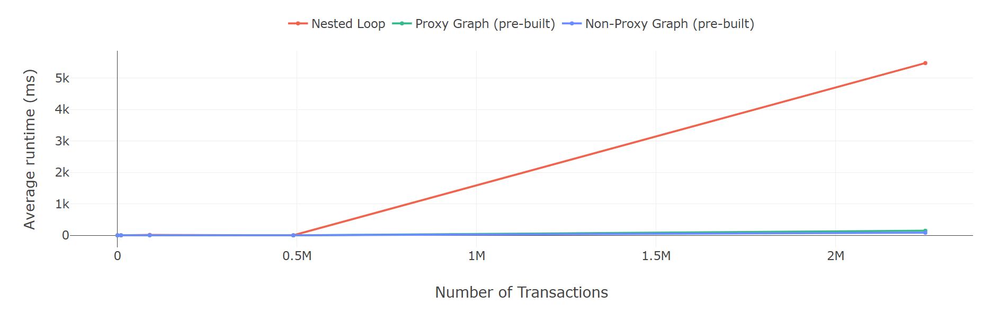

# Entity Walker


**Entity Walker** is a zero-dependency, type-safe TypeScript graph library for navigating relational data through intuitive traversal chains.

Model your data as a graph of entities connected by foreign keys, then traverse relationships with full TypeScript autocomplete — forward and reverse — as if you were walking through your data.

---

## Core Idea

Instead of writing nested loops or manual joins:

```ts
transactions.map(t =>
  subcategories.find(s =>
    mainCategories.find(m => ...)
  )
)
```
You simply walk the graph:

```ts
graph.transaction("tx1")
  .subcategory()
  .mainCategory()
  .value()?.name
```

## What You Can Use It For
* Read-heavy data models (dashboards, analytics, finance apps)
* Normalized API data (client-side joins without nesting)
* Deep entity navigation (multi-hop relationships)
* Reverse lookups (find all entities pointing to another)
* Data integrity validation
* In-memory graph exploration

## Features

* **Immutable & safe** — returned entities are frozen objects.
* **Type-safe & autocompleted** — TypeScript knows every entity type and every relation.
* **Bidirectional relations** — traverse forwards (1-to-1) or backwards (1-to-many) safely.
* **Rich node-list API** — `.where()`, `.ids()`, `.entities()`, `.select()`, `.unique()`, `.unique()`, `.isEmpty()` and more work directly on related entity collections.
* **Consistent defaults** — every node exposes `.value()` (safe, returns `undefined` when missing) and `.valueOrThrow()` (throws when missing). No split between optional and required at the type level.
* **Performance-friendly** — indexed O(1) lookups; even rebuilding the graph per query beats nested loops at scale.
* **Proxy-free alternative** — `createNonProxyGraph` produces an equivalent graph for environments without `Proxy` support.
* **Data integrity checks** — `graph.info()` detects missing FK targets and orphan entities at runtime.

## Installation

```bash
npm install entity-walker
```

## Quick Example

```typescript
import { createGraph, ValidSchema, GraphEdges, GraphDef, Entities, EntityGraph } from "entity-walker";

type Transaction  = { id: string; subcategoryId: string };
type Subcategory  = { id: string; name: string; mainCategoryId: string };
type MainCategory = { id: string; name: string; expenseTypeId?: string };

type Schema = ValidSchema<{
  transaction:  Transaction;
  subcategory:  Subcategory;
  mainCategory: MainCategory;
}>;

const edges = {
  transaction: {
    subcategory: { bidirectional: true, resolve: t => t.subcategoryId },
  },
  subcategory: {
    mainCategory: { bidirectional: true, resolve: s => s.mainCategoryId },
  },
} as const satisfies GraphEdges<Schema>;

type CustomGraph = GraphDef<Schema, typeof edges>;

const entities: Entities<Schema> = {
  transaction:  [{ id: "tx1", subcategoryId: "sub1" }],
  subcategory:  [{ id: "sub1", name: "Groceries", mainCategoryId: "cat1" }],
  mainCategory: [{ id: "cat1", name: "Food" }],
};

const graph: EntityGraph<CustomGraph> = createGraph({ entities, edges });

// Forward traversal
const categoryName = graph
  .transaction("tx1")
  .subcategory()
  .mainCategory()
  .value()?.name; // "Food"

// Reverse traversal
const txIds = graph
  .mainCategory("cat1")
  .subcategoryNodes()
  .transactionNodes()
  .ids(); // ["tx1"]
```

## Detailed Guides

| Guide | Description |
|---|---|
| [Graph](docs/graph.md) | Full reference for `createGraph` — the standard API with clean `graph.entity("id")` / `node.relation()` syntax powered by `Proxy`. |
| [Non-Proxy Graph](docs/non-proxy-graph.md) | Full reference for `createNonProxyGraph` — identical behaviour using a `.to()` calling convention, compatible with environments that do not support `Proxy`. |
| [Graph Modification](docs/modification.md) | Insert, update (upsert), delete, and cascade-delete entities at runtime with automatic index maintenance. |
| [Debugging](docs/debugging.md) | Use `graph.info()` to inspect entity counts, missing FK targets, and orphan entities. |

## Performance & Benchmarks

Entity Walker builds an in-memory index at construction time so every lookup is **O(1)**. Even with several rebuilding the graph out-performs hand-written nested loops at scale:



The benchmark compares pure indexed `for` loops against Entity Walker (with Proxy and without Proxy) across increasing dataset sizes with random id access patterns on multi-hop (4 relations). Entity Walker's indexed lookups dominate as dataset size grows. Proxy vs non-Proxy performance differs by a small constant factor, but both are much faster than nested loops at scale. The non-Proxy version is faster than Proxy (average ~1ms faster), but the difference is negligible compared to the gap with nested loops.