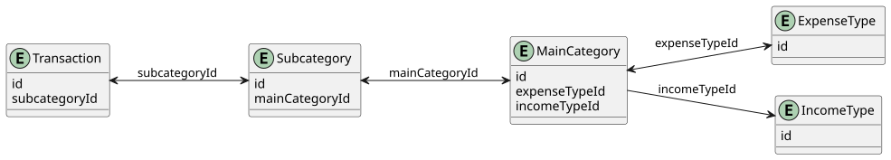

# Entity Graph — Full Guide (`createGraph`)

`createGraph` is the standard way to build an Entity Walker graph. It uses JavaScript `Proxy` objects to expose every entity type and relation as a directly callable property, giving you the cleanest possible call syntax and full TypeScript autocomplete.

> If your environment does not support `Proxy` or
> you need polyfills or other workarounds, see the [Non-Proxy Graph guide](./non-proxy-graph.md).

---

## Table of Contents

- [Entity Graph — Full Guide (`createGraph`)](#entity-graph--full-guide-creategraph)
  - [Table of Contents](#table-of-contents)
  - [Concepts: Types, Entry Points \& Function Categories](#concepts-types-entry-points--function-categories)
    - [The two runtime types](#the-two-runtime-types)
    - [Graph entry points](#graph-entry-points)
    - [`EntityNode` — function categories](#entitynode--function-categories)
    - [`EntityNodeList` — function categories](#entitynodelist--function-categories)
    - [Flow diagram](#flow-diagram)
  - [1. Define Your Entity Types](#1-define-your-entity-types)
  - [2. Define Your Schema \& Edges](#2-define-your-schema--edges)
    - [Schema](#schema)
    - [Edges](#edges)
    - [Graph Type](#graph-type)
  - [3. Build the Graph](#3-build-the-graph)
  - [4. Access Entities](#4-access-entities)
  - [5. Forward Traversal](#5-forward-traversal)
  - [6. Reverse Traversal](#6-reverse-traversal)
  - [7. Safe Defaults for Missing Data](#7-safe-defaults-for-missing-data)
  - [8. Node Lists](#8-node-lists)
    - [Built-in helpers](#built-in-helpers)
    - [Traversal from a list](#traversal-from-a-list)
    - [Examples](#examples)
  - [9. Scoped Traversal](#9-scoped-traversal)
    - [How Scope Works](#how-scope-works)
    - [Example: Strict Round-Trip](#example-strict-round-trip)
    - [Example: Multiple Scopes (Progressive Narrowing)](#example-multiple-scopes-progressive-narrowing)
    - [Resetting Scope](#resetting-scope)
  - [10. Root-Level List Access](#10-root-level-list-access)
  - [11. Debugging](#11-debugging)
    - [Node-level](#node-level)
    - [List-level](#list-level)
    - [Graph-level](#graph-level)
  - [12. Safe Initialization (`emptyNode`, `emptyNodeList`)](#12-safe-initialization-emptynode-emptynodelist)

---

## Concepts: Types, Entry Points & Function Categories

Understanding two core types and which functions belong to each is the key to reading any Entity Walker chain.

### The two runtime types

| Type | How you get one | Represents |
|---|---|---|
| `EntityNode` | `graph.entity("id")` | A single entity reference (may point to a missing entity — safe) |
| `EntityNodeList` | `graph.entityNodes(where?)` or any `…Nodes()` call | A collection of entity references — always a real `Array` |

**Once you are on an `EntityNodeList` there is no way back to a single `EntityNode` through further traversal.** List-level traversal always returns another `EntityNodeList`. The only way to get a plain entity object out of a list is through a terminal method.

### Graph entry points

```typescript
graph.transaction("tx1") // EntityNode<CustomGraph,Transaction>
graph.transactionNodes() // EntityNodeList<CustomGraph,Transaction>
```

### `EntityNode` — function categories

**Traversal — returns another `EntityNode` (1-to-1 forward edges)**

```typescript
graph.transaction("tx1").subcategory() // EntityNode<CustomGraph,Subcategory>
```

Each of these corresponds to a forward edge you declared in `edges`. A missing link propagates silently — you always get a valid `EntityNode` back, it just resolves to `undefined` when you read the value.

**Traversal — returns an `EntityNodeList` (1-to-many reverse edges)**

```typescript
graph.mainCategory("tx1").subcategoryNodes() // EntityNodeList<CustomGraph,Subcategory>
```

Only available when the edge was declared `bidirectional: true`. Calling this on a missing node always returns an empty list.

**Terminal — reads data, ends the traversal chain**

```typescript
node.value()         // Entity | undefined
node.valueOrThrow()  // Entity           (throws if missing)
node.exists()        // boolean
node.path()          // string[]
node.info()          // NodeDebugInfo
```

**Mutation — modifies the entity in-place**

```typescript
node.update(fn)      // void — update fields via callback (id is preserved)
node.delete()        // void — remove entity from graph
node.deleteCascade() // void — remove entity and all referencing entities
```

These do not return a node or a list, so the chain ends here.

### `EntityNodeList` — function categories

`EntityNodeList` is a real JavaScript `Array`, so every standard array method (`map`, `filter`, `flatMap`, `reduce`, `find`, `some`, `every`, `length`, …) works on it. Their return types (`EntityNode[]`) follow normal array semantics — they are **not** `EntityNodeList` and traversal cannot continue through them.

**Traversal — returns an `EntityNodeList` (the only traversal available on a list)**

Only `…Nodes()` methods exist on a list. There is no `[entity]()` (single-node) traversal from a list — you cannot get back to a single `EntityNode` through list traversal.

```typescript
list.subcategoryNodes()    // EntityNodeList<CustomGraph,Subcategory>
list.transactionNodes()    // EntityNodeList<CustomGraph,Transaction>
list.mainCategoryNodes()   // EntityNodeList<CustomGraph,MainCategory>
```

Both forward and bidirectional-reverse edges appear as `…Nodes()` on a list, collecting results across all nodes in the list (equivalent to a `flatMap`).

**Chainable transformers — return a new `EntityNodeList`, traversal can continue**

```typescript
list.where(predicate)     // EntityNodeList<CustomGraph,Entity>   (filter nodes by entity predicate)
list.whereNode(predicate) // EntityNodeList<CustomGraph,Entity>   (filter by node property predicate)
list.unique()             // EntityNodeList<CustomGraph,Entity>   (remove duplicates by id)
list.intersect(other)     // EntityNodeList<CustomGraph,Entity>   (intersection with other lists/ids)
list.scoped()             // EntityNodeList<CustomGraph,Entity>   (snapshot scope for current traversal)
list.resetScope()         // EntityNodeList<CustomGraph,Entity>   (clear the traversal scope)
list.with(fn)             // T                                    (encapsulate sub-traversal or return scalar)
```

**Terminal — reads data, ends the traversal chain**

```typescript
list.entities()          // Entity[]              plain objects for all present nodes
list.ids()               // string[]
list.select(fn)          // R[]                   projection over present entities
list.first()             // Entity | undefined
list.findEntity(pred)    // Entity | undefined
list.findNode(pred)      // EntityNode | undefined — node for further traversal
list.isEmpty()           // boolean
list.isNotEmpty()        // boolean
```

Standard array methods such as `.map()`, `.filter()`, `.flatMap()` are also terminal in this sense — they return plain arrays (`EntityNode[]`), not `EntityNodeList`, so list-level traversal ends.

### Flow diagram

```
graph
 ├─ .entity("id")          → EntityNode
 │    ├─ .entity()         → EntityNode          (forward, 1-to-1)
 │    ├─ .entityNodes()    → EntityNodeList      (reverse, 1-to-many)
 │    ├─ .update(fn)       → void                 (mutate fields, id preserved)
 │    ├─ .delete()         → void                 (remove from graph)
 │    ├─ .deleteCascade()  → void                 (remove with referencing entities)
 │    └─ .value() etc.     → terminal
 │
 └─ .entityNodes()         → EntityNodeList
      ├─ .entityNodes()    → EntityNodeList      (only …Nodes() traversal on lists)
      ├─ .where() / .whereNode() → EntityNodeList (chainable)
      ├─ .scoped() / .unique()   → EntityNodeList (chainable)
      ├─ .intersect()      → EntityNodeList      (chainable)
      ├─ .with(fn)         → T                   (custom return or sub-chain)
      ├─ .ids() etc.       → terminal
      └─ .map() etc.       → plain Array (standard JS — terminal)
```

---

## 1. Define Your Entity Types

Every entity must have an `id: string` field. Any other fields are up to you.

```typescript
type Transaction  = { id: string; subcategoryId: string };
type Subcategory  = { id: string; name: string; mainCategoryId: string };
type MainCategory = { id: string; name: string; expenseTypeId?: string; incomeTypeId?: string };
type ExpenseType  = { id: string; description: string };
type IncomeType   = { id: string; description: string };
```

---

## 2. Define Your Schema & Edges

### Schema

Collect your entity types into a schema map wrapped in `ValidSchema<…>`. `ValidSchema` is a compile-time guard that produces a clear error if any entity key conflicts with a reserved name. The following keys are reserved and cannot be used as entity type names: `[...]Nodes (like transactionNodes)`, `schema`, `info`, `to`

```typescript
type Schema = ValidSchema<{
  transaction:  Transaction;
  subcategory:  Subcategory;
  mainCategory: MainCategory;
  expenseType:  ExpenseType;
  incomeType:   IncomeType;
}>;
```

### Edges

Define the foreign-key relationships between entity types. Annotate with `as const satisfies GraphEdges<Schema>` so TypeScript can fully infer the shape of every node and relation.



```typescript
export const edges = {
  transaction: {
    subcategory: { bidirectional: true, resolve: t => t.subcategoryId },
  },
  subcategory: {
    mainCategory: { bidirectional: true, resolve: s => s.mainCategoryId },
  },
  mainCategory: {
    expenseType: { bidirectional: true, resolve: m => m.expenseTypeId },
    incomeType:  {                       resolve: m => m.incomeTypeId  },
  },
} as const satisfies GraphEdges<Schema>;
```

Each edge definition:

| Field | Type | Description |
|---|---|---|
| `resolve` | `(entity: Source) => string \| undefined` | Extracts the foreign key value from the source entity. Return `undefined` when the field is absent or the relation does not apply. |
| `bidirectional` | `boolean` (optional, default `false`) | When `true`, the reverse direction is also traversable via `…Nodes()` methods on the target entity type. |

### Graph Type

Define a convenience type alias so you can annotate function parameters and variables without repeating the generics everywhere.

```typescript
type CustomGraph = GraphDef<Schema, typeof edges>;
```

> **API-Bound Graphs**: If your graph connects to a remote REST API / OpenAPI SDK, use `ValidApi<CustomGraph>` to type your API configuration.
> See the [API-Bound Graph guide](./api-graph.md) for full details.

---

## 3. Build the Graph

```typescript
import { createGraph, Entities, EntityGraph } from "entity-walker";

const entities: Entities<Schema> = {
  transaction: [
    { id: "tx1", subcategoryId: "sub1" },
    { id: "tx2", subcategoryId: "sub2" },
    { id: "tx3", subcategoryId: "sub1" },
  ],
  subcategory: [
    { id: "sub1", name: "Groceries", mainCategoryId: "cat1" },
    { id: "sub2", name: "Transport", mainCategoryId: "cat1" },
  ],
  mainCategory: [
    { id: "cat1", name: "Food",    expenseTypeId: "et1", incomeTypeId: "it1" },
    { id: "cat2", name: "Broken",  expenseTypeId: "bad", incomeTypeId: "bad" },
    { id: "cat3", name: "NoLinks"                                             },
  ],
  expenseType: [{ id: "et1", description: "Groceries" }],
  incomeType:  [{ id: "it1", description: "Salary"    }],
};

const graph: EntityGraph<CustomGraph> = createGraph({ entities, edges });
```

The graph builds an in-memory index over your entity arrays. It never mutates your original data. Rebuilding the graph with a new `entities` object is cheap and safe.

---

## 4. Access Entities

Call the entity type as a function on the graph, passing the `id`, to get an **`EntityNode`**.

```typescript
const node = graph.transaction("tx1");
```

On any node you have:

| Method | Return type | Description |
|---|---|---|
| `.value()` | `Entity \| undefined` | Returns the frozen entity object, or `undefined` if it does not exist in the graph. |
| `.valueOrThrow()` | `Entity` | Returns the frozen entity object. Throws a descriptive error if it does not exist. |
| `.exists()` | `boolean` | `true` if the entity exists in the graph. |
| `.path()` | `string[]` | The traversal path that led to this node, e.g. `["transaction(tx1)", "subcategory(sub1)"]`. |
| `.info()` | `NodeDebugInfo` | Full debug snapshot: `{ type, id, exists, path, value }`. |
| `.update(fn)` | `void` | Update entity fields via a callback. The `id` is always preserved. Safe no-op if entity does not exist. |
| `.delete()` | `void` | Remove the entity from the graph. No-op if it does not exist. |
| `.deleteCascade()` | `void` | Remove the entity and all entities that reference it, recursively. |

```typescript
graph.transaction("tx1").value();        // Transaction | undefined
graph.transaction("tx1").valueOrThrow(); // Transaction — throws if "tx1" is not in the graph
graph.transaction("tx1").exists();       // true
graph.transaction("missing").exists();   // false
```

---

## 5. Forward Traversal

Each edge you defined in `edges` becomes a callable method on the source entity node. Forward edges model **1-to-1** relations and return a single `EntityNode`.

```typescript
// Traverse one hop
const sub = graph.transaction("tx1").subcategory();

// Chain multiple hops
const expenseType = graph
  .transaction("tx1")
  .subcategory()
  .mainCategory()
  .expenseType();

expenseType.value()?.description; // "Groceries"
expenseType.valueOrThrow().description;
```

A missing link anywhere in the chain **does not throw** — it returns a null node that propagates silently through `.value()`. Only `.valueOrThrow()` throws, and it does so at the point you call it.

```typescript
// "cat3" has no expenseTypeId → expenseType node exists but resolves to null
graph.mainCategory("cat3").expenseType().value();        // undefined — safe
graph.mainCategory("cat3").expenseType().valueOrThrow(); // throws

// "cat2" has expenseTypeId "bad" which is not in the graph → same behaviour
graph.mainCategory("cat2").expenseType().value();        // undefined — safe
graph.mainCategory("cat2").expenseType().valueOrThrow(); // throws
```

---

## 6. Reverse Traversal

When an edge is declared `bidirectional: true`, a corresponding `…Nodes()` method is added to the **target** entity type. Reverse edges model **1-to-many** relations and return an `EntityNodeList` (see [§8](#8-node-lists)).

```typescript
// All subcategories that point to cat1
const subs = graph.mainCategory("cat1").subcategoryNodes();

// All transactions that point to sub1 (via sub1 → cat1 → expenseType chain)
const txIds = graph
  .mainCategory("cat1")
  .subcategoryNodes()
  .transactionNodes()
  .ids();
// ["tx1", "tx3", "tx2"]
```

Use `.where()` to filter the results before returning the list:

```typescript
const grocerySubs = graph
  .mainCategory("cat1")
  .subcategoryNodes()
  .where(sc => sc.name === "Groceries");
```

If the parent node does not exist, reverse methods always return an empty list — they never throw.

---

## 7. Safe Defaults for Missing Data

Every node, regardless of whether the FK field is optional on the type or the target entity is simply absent from the dataset, exposes the same two methods. There is no separate "optional edge" concept at the calling level.

| Scenario | `.value()` | `.valueOrThrow()` |
|---|---|---|
| Entity exists | Returns the entity | Returns the entity |
| Entity not in graph (bad id) | `undefined` | Throws |
| FK field is `undefined` | `undefined` | Throws |
| FK points to non-existent entity | `undefined` | Throws |
| Chain passes through a missing node | `undefined` | Throws |

```typescript
// All of these safely return undefined
graph.transaction("nonexistent").value();
graph.mainCategory("cat3").expenseType().value();
graph.mainCategory("cat2").expenseType().value();
graph.transaction("tx1").subcategory().mainCategory().expenseType().value(); // fine as long as et1 exists
```

---

## 8. Node Lists

Any method returning multiple entities returns an **`EntityNodeList`** — a real `Array` extended with extra helpers. Because it is a real array, all standard methods such as `.filter()`, `.map()`, `.flatMap()`, `.reduce()`, `.length`, etc. work without any wrapping.

### Built-in helpers

| Method | Description |
|---|---|
| `.entities()` | Returns plain entity objects for all present nodes (skips nodes whose entity is missing). |
| `.ids()` | Returns `id` strings for all present entities. |
| `.select(fn)` | Maps over present entities with a projection function. |
| `.first()` | Returns the first present entity, or `undefined`. |
| `.findEntity(predicate)` | Returns the first entity satisfying the predicate, or `undefined`. |
| `.findNode(predicate)` | Returns the first node whose entity satisfies the predicate, or `undefined`. Unlike `findEntity`, returns the node so traversal can continue. |
| `.where(predicate)` | Returns a new `EntityNodeList` containing only nodes matching the predicate. |
| `.whereNode(predicate)` | Returns a new `EntityNodeList` filtered by node properties. |
| `.unique()` | Returns a new `EntityNodeList` deduped by `id`. |
| `.intersect(other)` | Returns a new `EntityNodeList` representing the intersection with another list or set of IDs. |
| `.scoped()` | "Locks" the current IDs into the traversal scope. Traversal away and back to this type will only return these IDs. |
| `.resetScope()` | Clears all scope restrictions from the list. |
| `.with(fn)` | Executes a callback with the current list, allowing for complex sub-filtering or scalar returns. |
| `.isEmpty()` | `true` if no present entities remain. |
| `.isNotEmpty()` | `true` if at least one present entity exists. |

### Traversal from a list

Any forward or reverse relation can be called on a list to traverse **all** nodes in the list at once, returning a new `EntityNodeList`. This is the equivalent of `.flatMap` but stays fully typed.

```typescript
// All forward edges become …Nodes() on the list
graph.subcategoryNodes()
  .mainCategoryNodes()     // all main categories reached from all subcategories
  .expenseTypeNodes()
  .ids();

// All bidirectional reverse edges also appear as …Nodes() on the list
graph.expenseTypeNodes()
  .mainCategoryNodes()
  .subcategoryNodes()
  .transactionNodes()
  .ids();
```

Use `.where()` to filter the resulting list:

```typescript
graph.mainCategoryNodes()
  .subcategoryNodes()
  .where(sc => sc.name === "Groceries")
  .ids();
```

### Examples

```typescript
// ids() — quick extraction
const ids = graph.mainCategory("cat1")
  .subcategoryNodes()
  .flatMap(sc => sc.transactionNodes())
  .ids();

// entities() — plain objects
const names = graph.subcategoryNodes().entities().map(sc => sc.name);

// select() — projection
const descriptions = graph
  .mainCategoryNodes(c => !!c.expenseTypeId)
  .expenseTypeNodes()
  .select(et => et.description);

// first() / findEntity() / findNode()
const first   = graph.transactionNodes().first();
const special = graph.transactionNodes().findEntity(t => t.subcategoryId === "sub2");

// findNode() — returns a node so you can keep traversing
const node = graph.subcategoryNodes().findNode(s => s.name === "Groceries");
const catName = node?.mainCategory().value()?.name; // "Food"

// where() — filter and keep as EntityNodeList for further traversal
const filtered = graph
  .subcategoryNodes()
  .where(sc => sc.mainCategoryId === "cat1")
  .transactionNodes()
  .ids();

// unique() — deduplicate after a flatMap
const uniqueMainCats = graph
  .subcategoryNodes()
  .mainCategoryNodes()
  .unique()
  .ids();

// isEmpty / isNotEmpty
if (graph.mainCategory("cat3").subcategoryNodes().isEmpty()) {
  console.log("no subcategories");
}
```

---

## 9. Scoped Traversal

The `.scoped()` method allows you to "remember" a set of entities during a complex traversal chain. Once a list is scoped, any future traversal that reaches that entity type will be restricted to the IDs that were present when `.scoped()` was called.

### How Scope Works

1. **Type Sensitivity**: Scoping an `EntityNodeList` of type `transaction` only restricts future `transaction` nodes. It does not affect `subcategory` or `mainCategory` nodes.
2. **AND-Composition**: Each call to `.scoped()` for the same type adds a new restriction. The resulting scope is the **intersection (AND)** of all previous restrictions for that type. Scope can only get smaller and smaller.
3. **Inheritance**: Scopes are carried forward automatically through all subsequent `.to()`, `.relation()`, and `.where()` calls.
4. **Inspecting Scope**: You can check the currently active scope restrictions at any point by calling `.info()` on the list.

### Example: Strict Round-Trip

Without scrolling, jumping back and forth across relations might pick up "neighbors" you didn't start with. `.scoped()` prevents this.

```typescript
const start = graph.transactionNodes()
  .where(t => t.id === "tx1")
  .scoped(); // Only "tx1" allowed for transactions

const backAndForth = start
  .subcategoryNodes()
  .mainCategoryNodes()
  .subcategoryNodes()
  .transactionNodes(); // Traverses through the graph...

backAndForth.ids(); // ["tx1"]
```

### Example: Multiple Scopes (Progressive Narrowing)

```typescript
const narrowed = graph.transactionNodes()
  .scoped()                          // ids: ["tx1", "tx2", "tx3"]
  .where(t => t.id !== "tx1")
  .scoped()                          // ids: ["tx2", "tx3"] (intersection of previous and current)
  .where(t => t.id === "tx3")
  .scoped();                         // ids: ["tx3"]

const final = narrowed
  .subcategoryNodes()
  .transactionNodes(); 

final.ids(); // ["tx3"]
```

### Resetting Scope

If you need to break out of a scoped context while keeping your current list, use `.resetScope()`. This returns a new `EntityNodeList` with all restrictions removed.

```typescript
const scoped = graph.transactionNodes().where(t => t.id === "tx1").scoped();
const free = scoped.resetScope();

// Future traversals from 'free' are no longer restricted by 'tx1'
```

---

## 10. Root-Level List Access

Access all entities of a given type directly from the graph via `graph.[type]Nodes()`. Use `.where()` for filtering.

```typescript
// All transactions
const all = graph.transactionNodes();

// Filtered subset
const sub1Txs = graph.transactionNodes().where(t => t.subcategoryId === "sub1");

// Any entity type
const foodCategories = graph.mainCategoryNodes().where(c => c.name === "Food");

// Combine with list traversal
const ids = graph
  .mainCategoryNodes()
  .where(c => !!c.expenseTypeId)
  .subcategoryNodes()
  .transactionNodes()
  .ids();
```

---

## 10. Debugging

### Node-level

```typescript
const node = graph.transaction("tx1").subcategory().mainCategory();

node.exists();
// true

node.path();
// ["transaction(tx1)", "subcategory(sub1)", "mainCategory(cat1)"]

node.info();
// {
//   type:   "mainCategory",
//   id:     "cat1",
//   exists: true,
//   path:   ["transaction(tx1)", "subcategory(sub1)", "mainCategory(cat1)"],
//   value:  { id: "cat1", name: "Food", expenseTypeId: "et1", incomeTypeId: "it1" },
// }
```

### List-level

Call `.info()` on any `EntityNodeList` to inspect its type, size, and current traversal scope.

```typescript
const list = graph.transactionNodes()
  .where(t => t.id === "tx1" || t.id === "tx2")
  .scoped();

const info = list.info();
// {
//   type:   "transaction",
//   length: 2,
//   scope:  { transaction: ["tx1", "tx2"] }
// }
```

The `scope` property allows you to check the actual state of the restricted traversal scope at any point in your chain, which is especially useful for verifying which AND-composed filters are currently affecting a traversal.

### Graph-level

```typescript
// Structural summary of entity types and declared edges
const schema = graph.schema();
// {
//   entities: ["transaction", "subcategory", "mainCategory", "expenseType", "incomeType"],
//   edges: [
//     { from: "transaction",  to: "subcategory",  bidirectional: true  },
//     { from: "subcategory",  to: "mainCategory", bidirectional: true  },
//     { from: "mainCategory", to: "expenseType",  bidirectional: true  },
//     { from: "mainCategory", to: "incomeType",   bidirectional: false },
//   ],
// }

// Runtime data quality report
const info = graph.info();
// {
//   entityCounts:    { transaction: 3, subcategory: 2, mainCategory: 3, expenseType: 1, incomeType: 1 },
//   cache:           { nodeCount: 0 },      // nodes created so far this graph instance
//   missingEntities: [                       // FK values with no matching entity
//     { type: "expenseType", id: "bad" },
//     { type: "incomeType",  id: "bad" },
//   ],
//   orphanEntities:  { ... },                // entities not referenced by any FK
// }
```

---

## 12. Safe Initialization (`emptyNode`, `emptyNodeList`)

Sometimes you need to initialize a variable with a "null" node or list that can still be part of a traversal chain without throwing errors or requiring complex null checks.

### `emptyNode()`

Returns an `EntityNode` that behaves like a missing node. Any relation called on it will return another empty node (or empty list), allowing safe traversal.

```typescript
import { emptyNode } from "entity-walker";

let node = emptyNode<CustomGraph, Transaction>();

// Safe to traverse, even though it's empty
const catName = node.subcategory().mainCategory().value()?.name; // undefined
node.exists(); // false
```

### `emptyNodeList()`

Returns an `EntityNodeList` that behaves like an empty collection.

```typescript
import { emptyNodeList } from "entity-walker";

let list = emptyNodeList<CustomGraph, Transaction>();

list.isEmpty(); // true
list.subcategoryNodes().isEmpty(); // true
```

